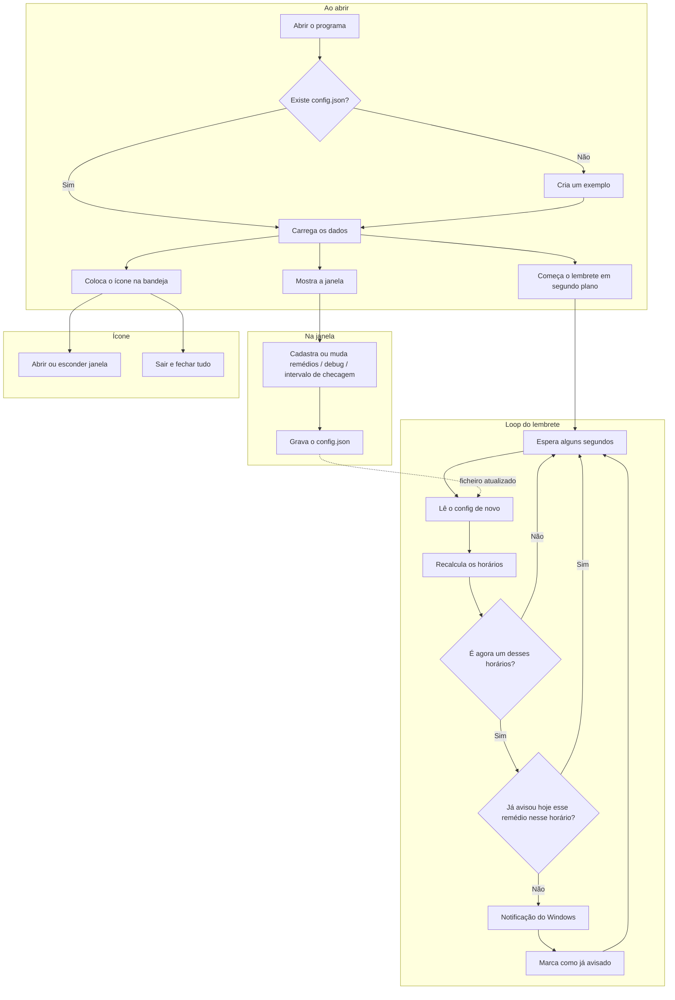

# Lembretes de medicamento (Windows)

Pequena app em Python para não esquecer os remédios. Cadastra-se cada medicamento com o nome, a hora da primeira toma, de quantas em quantas horas repetir e quantas vezes por dia; o programa monta os horários e avisa com a notificação normal do Windows. Dá para deixar a correr quieta perto do relógio, na bandeja.

O que **não** faz: não lembra de comprar, não confirma dose com receita, não substitui médico ou farmacêutico.

---

## O que usar no dia a dia

Na janela principal inclui-se, altera-se ou apaga-se itens na lista. Para cada remédio: nome, primeira hora do dia (formato 24 h, tipo `08:30`), intervalo entre uma toma e outra em **horas** (pode ser `4,5`), e quantas doses no dia. A coluna de horários mostra o que vai sair (por exemplo 08:00, 14:00, 20:00).

Fechar a janela pelo X **não encerra** o programa: só esconde. Para voltar, botão direito no ícone azul perto do relógio → Abrir, ou menu Ficheiro. Tudo o que se muda fica no ficheiro `config.json` na mesma pasta do programa (ou do `.exe`).

**Modo debug:** marcar a opção de intervalo em **minutos** para testar rápido, sem esperar horas. O número do intervalo passa a ser minutos; o título da janela e o aviso do Windows indicam que é teste. Convém baixar o “verificar relógio a cada X segundos” para uns 5–15 s nessa altura.

---

## Como a automação funciona (passo a passo)

1. Edita-se a lista e o programa grava o `config.json`.
2. Ao ler, o programa corrige valores inválidos e, se encontrar formato antigo só com lista de horários (`times`), converte para o modelo novo.
3. A partir da primeira hora, do intervalo e do número de doses, calculam-se todos os horários do dia (em horas, ou em minutos com o debug ligado).
4. Em segundo plano, de X em X segundos, volta a ler o `config.json` e compara com o relógio do Windows. Assim, uma alteração na janela aplica-se sem reiniciar.
5. Se o minuto atual coincide com um lembrete e esse remédio a essa hora **ainda não** avisou hoje, dispara-se a notificação e regista-se para não repetir no mesmo dia.
6. A janela e o ícone da bandeja convivem com esse ciclo; só “Sair” na bandeja encerra o lembrete de facto.

### Desenho do fluxo

Visão geral em diagrama (no GitHub o desenho aparece sozinho):



---

## Requisitos

Windows 10 ou 11. Para rodar o código: Python 3.10 ou mais recente.

---

## Instalar e correr pelo código

```powershell
cd c:\Users\professor\Downloads\medicamento
python -m pip install -r requirements.txt
python medicamento_app.py
```

O ficheiro `medicamento_tray.py` só chama o mesmo programa.

Sem janela preta de consola:

```powershell
pythonw medicamento_app.py
```

Se faltar a interface gráfica, o instalador do Python no Windows tem de incluir o Tcl/Tk (opção habitual no instalador oficial).

---

## O que vai no `config.json`

| Campo | Para que serve |
|--------|----------------|
| `check_interval_seconds` | A cada quantos segundos o programa olha o relógio (entre 5 e 300). Dá para mudar na barra da janela. |
| `debug_interval_in_minutes` | Se for `true`, o número de intervalo de cada remédio é em **minutos** (só para teste). |
| `medications` | Lista de remédios. |
| `medications[].id` | ID interno (o programa gera). |
| `medications[].name` | Nome que aparece no aviso. |
| `medications[].first_time` | Primeira toma do dia, `HH:MM`. |
| `medications[].interval_hours` | No modo normal = horas entre tomas; com debug ligado = minutos (o nome do campo continua esse no JSON). |
| `medications[].doses_per_day` | Quantas vezes por dia (1 a 48). |

Quem tinha um ficheiro antigo só com `"times": ["08:00", ...]`, à primeira abertura o programa converte e, ao gravar, passa para o formato novo.

Exemplo:

```json
{
  "check_interval_seconds": 20,
  "debug_interval_in_minutes": false,
  "medications": [
    {
      "id": "…",
      "name": "Vitamina D",
      "first_time": "08:00",
      "interval_hours": 6,
      "doses_per_day": 3
    }
  ]
}
```

A conta dos horários é: primeira hora + 0, 1, 2… vezes o intervalo, até completar o número de doses (virando a meia-noite quando precisar).

---

## Gerar o `.exe`

Um único executável sem consola, em `dist\MedicamentoLembretes.exe`:

```powershell
.\build_exe.ps1
```

Ou à mão:

```powershell
python -m pip install -r requirements.txt -r requirements-build.txt
python -m PyInstaller --clean --noconfirm medicamento_tray.spec
```

Manter o `config.json` na **mesma pasta** do `.exe` (ou correr uma vez: ele cria um modelo).

O antivírus por vezes demora na primeira execução de `.exe` gerados com PyInstaller; é incómodo mas frequente.

---

## Bandeja, notificações, arranque com o Windows

- Ícone: botão direito → Abrir, Ocultar ou Sair. Sair fecha tudo.
- Se o aviso não aparecer: Configurações → Sistema → Notificações, e verificar se o programa não está silenciado.
- Arranque com o Windows: `Win+R`, `shell:startup`, atalho para `MedicamentoLembretes.exe` com o `config.json` na mesma pasta.

---

## Ficheiros e dependências

O núcleo é o `medicamento_app.py`. O `medicamento_tray.py` é só entrada alternativa. Para o `.exe`: `medicamento_tray.spec` e `build_exe.ps1`. Dependências listadas em `requirements.txt` e `requirements-build.txt`.

Pacotes: [winotify](https://pypi.org/project/winotify/) (toast), [pystray](https://pypi.org/project/pystray/) e [Pillow](https://pypi.org/project/Pillow/) (ícone na bandeja).

---

Isto é só um **alarme**; confirme dose e horário com quem acompanha a sua saúde.
